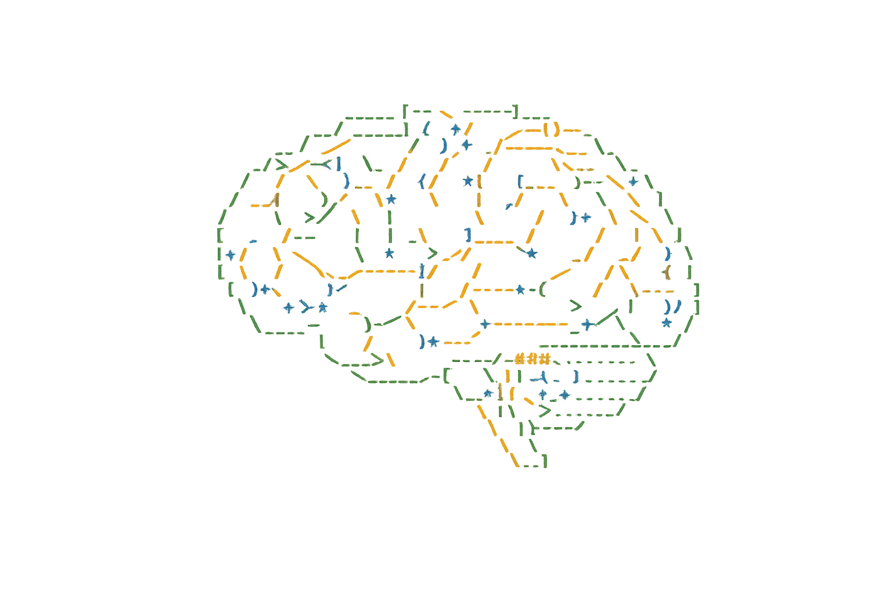

<p align="center">
  
</p>

<h1 align="center">BizBrain OS — Claude Code Plugin</h1>

<p align="center">
  <strong>Persistent knowledge brain for Claude Code. Install once, never re-explain your business again.</strong>
</p>

<p align="center">
  <a href="LICENSE"></a>
  
  
  
  
  <a href="#privacy--security"></a>
</p>

---

## What It Does

BizBrain OS builds a **persistent knowledge layer** on your machine. It captures your clients, projects, decisions, and workflows — then automatically injects that context into every Claude Code session.

- **Session 1:** You tell Claude about your business once
- **Session 2+:** Claude already knows. Permanently.

Every session deposits context. Every future session withdraws it. The balance only grows.

---

## See It In Action

<p align="center">
  <a href="https://www.youtube.com/watch?v=_NzW5FakGyw">
    
  </a>
</p>

<p align="center">
  <a href="https://www.youtube.com/watch?v=_NzW5FakGyw"></a>
</p>

---

## Quick Install

```bash
# Add the marketplace
claude plugin marketplace add TechIntegrationLabs/bizbrain-os-plugin

# Install the plugin
claude plugin install bizbrain-os
```

Then open a new terminal:

```bash
claude
> /brain setup
```

**5 minutes later:** Every Claude Code session starts pre-loaded with your full business context.

Launch the visual dashboard:

```bash
> /dashboard
```

---

## What Happens During Setup

```
/brain setup
   │
   ├─ 1. Basic Info ─────── Your name, business, role
   ├─ 2. Pick Profile ───── Developer / Agency / Consultant / Creator / Personal
   ├─ 3. Choose Mode ────── Full (3-zone) or Simple (1 folder)
   ├─ 4. Machine Scan ───── Auto-discovers repos, tools, services
   │     ├─ Found 45 repositories
   │     ├─ Found 5 services/tools
   │     └─ Found 25 Claude plugins
   ├─ 5. Intelligence ───── Paste URLs, drag-and-drop docs
   └─ 6. Brain Built ────── Context auto-injected from now on
```

---

## Features

### 21 Skills

| Category | Skills |
|:---------|:-------|
| **Core** | Brain bootstrap, entity management, project tracking, knowledge management |
| **Execution** | GSD workflow, todo management, time tracking, session archiving |
| **Operations** | Credential management, intake processing, MCP management, communications hub |
| **Content** | Content pipeline, outreach engine, meeting transcription |
| **Advanced** | Brain orchestration, Google Workspace, browser automation, intelligence gathering |

### 15 Commands

```
/brain          Brain status, setup, scan, configure
/dashboard      Visual command center in your browser
/entity         Client / partner / vendor lookup
/todo           Unified task dashboard
/knowledge      Search and load brain knowledge
/hours          Time tracking (today / week / month)
/gsd            Project execution: plan, execute, status
/intake         Process files dropped in _intake-dump
/mcp            MCP server management and profiles
/archive        Archive sessions to Obsidian vault
/comms          Communication hub
/content        Content pipeline
/outreach       Lead pipeline and sequences
/meetings       Local meeting transcription
/swarm          Brain Swarm orchestration
```

### 4 Background Agents

| Agent | Purpose |
|:------|:--------|
| **Brain Orchestrator** | Coordinates all agents via event queue, staging, validation, and changelog |
| **Entity Watchdog** | Monitors conversations for entity mentions, auto-updates records |
| **Brain Learner** | Captures decisions, action items, patterns, and session summaries |
| **Brain Gateway** | Full brain access from any repository or directory |

### Visual Dashboard

Type `/dashboard` and a browser-based command center opens with:

- **37-item setup checklist** across 8 categories with progress tracking
- **Integrations hub** — see all 37+ services at a glance
- **Intelligence gathering** — paste URLs, drag-and-drop documents
- **Quick launch** — open brain folder, conversations, repos with one click

### Meeting Transcription

Local recording and transcription that replaces cloud services like Otter.ai — for $0/month. Records any audio source (Zoom, Meet, Teams, Discord) via system audio capture. 100% private, nothing leaves your machine.

### Brain Swarm

Multi-agent orchestration layer (opt-in):

- **Event Queue** — Every tool use generates an event; orchestrator processes them in order
- **Staging Area** — Agents propose changes; validated before applying
- **Conflict Detection** — Two agents modifying the same file? Flagged for resolution
- **Changelog** — Full audit trail of every brain modification
- **Smart Routing** — Simple tasks to haiku, complex to sonnet — saves 40-60% on agent ops

---

## Integrations

37+ services with guided credential setup:

| Category | Services |
|:---------|:---------|
| **Development** | GitHub, Supabase, Stripe, Clerk, Netlify, Vercel |
| **Communication** | Slack, Discord, WhatsApp, Telegram, Gmail |
| **Social** | X/Twitter, LinkedIn, Facebook, Instagram, Bluesky, TikTok, YouTube, Reddit |
| **Productivity** | Notion, Google Workspace, Obsidian |
| **AI** | OpenAI, Anthropic, ElevenLabs, HeyGen |
| **Publishing** | Postiz, Late.dev, Buffer |

---

## Profiles

Pick your role during setup — features adapt automatically:

| Profile | Focus |
|:--------|:------|
| **Developer** | GSD workflow, repo tracking, Supabase, GitHub, credentials, time tracking |
| **Agency** | All features — clients, billing, content, outreach, comms, team tracking |
| **Consultant** | Client entities, proposals, time tracking, communications, billing |
| **Content Creator** | Content pipeline, social scheduling, outreach, audience management |
| **Personal** | Minimal: knowledge base, todos, intake. Easy to expand later |

Switch any time with `/brain profile`.

---

## Three-Zone Architecture

```
~/bizbrain-os/
├── launchpad/          Start all sessions here (~120 lines context)
├── workspaces/         Code repos live here (~80 lines, ultra-lean)
└── brain/              Full business intelligence (~300 lines)
    ├── Knowledge/
    ├── Entities/
    ├── Projects/
    ├── Operations/
    └── _intake-dump/
```

Zones control how much context loads by default. All commands work from any zone.

---

## Privacy & Security

```
  Your brain folder is LOCAL-ONLY — never uploaded
  No external API calls from the plugin
  No telemetry, no analytics, no phone-home
  Credentials cataloged locally, never auto-copied
  Values always masked in display
  Open source — read every line of code
```

---

## Requirements

| Requirement | Version | Notes |
|:------------|:--------|:------|
| Claude Code | Latest | With plugin support |
| Node.js | 18+ | For context generation |
| Bash | Any | Git Bash on Windows |
| Python | 3.10+ | *Optional* — meeting transcription only |

---

## Contributing

Contributions welcome.

1. Fork the repo
2. Create your feature branch (`git checkout -b feature/amazing-thing`)
3. Commit your changes
4. Open a Pull Request

See [CONTRIBUTING.md](CONTRIBUTING.md) for guidelines.

---

## License

[AGPL-3.0](LICENSE) — Free to use, modify, and distribute. Derivative works must also be open source.

---

<p align="center">
  <strong>Built by <a href="https://github.com/TechIntegrationLabs">Tech Integration Labs</a></strong>
  <br />
  <a href="https://bizbrainos.com">bizbrainos.com</a> · <a href="https://discord.gg/ph9D5gSgW3">Discord</a> · <a href="https://x.com/bizbrain_os">X / Twitter</a>
  <br /><br />
  <sub>Every session deposits context. Every future session withdraws it. The balance only grows.</sub>
</p>
